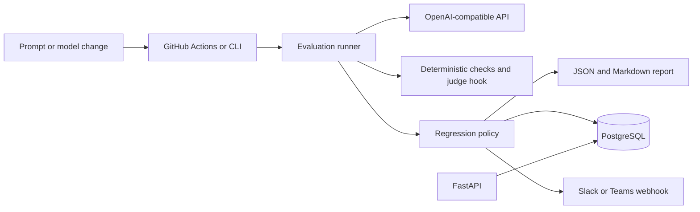

# LLM Regression Detection

[](https://github.com/imddevaraj/llm-quality-gate/actions/workflows/llm-regression.yml)
[](LICENSE)


## Functional definition

LLM Quality Gate is a CI/CD quality-gate service for LLM-powered features. It runs the same golden test cases against a known-good baseline and a proposed candidate configuration, scores both outputs, compares the results against configurable policies, and produces a pass/fail report.

The system supports prompt and model configuration changes, deterministic output checks, optional semantic LLM judging, repeated evaluations for nondeterministic models, latency and token-cost checks, flaky-case detection, report persistence, and failure notifications. It is designed to stop a change from being merged or deployed when quality or operational metrics violate policy.

## Goal and purpose

### Goal

Detect regressions in LLM feature quality before changed prompts, models, retrieval settings, or tools reach users.

### Purpose

- Give developers a repeatable local and CI command for evaluating LLM changes.
- Compare candidate behavior with a versioned baseline instead of relying on manual review.
- Enforce quality, reliability, latency, cost, and critical-test thresholds.
- Preserve raw outputs, score breakdowns, model metadata, latency, token usage, Git metadata, and timestamps for investigation.
- Alert engineering teams through Slack or Microsoft Teams when a quality gate fails.

## Technology stack

| Area | Technology |
| --- | --- |
| Language | Python 3.11 |
| API service | FastAPI, Uvicorn, Pydantic |
| CLI | Typer |
| Persistence | SQLAlchemy 2.x with PostgreSQL; SQLite for local quick starts |
| LLM integration | OpenAI-compatible Chat Completions API over HTTPX |
| Configuration | YAML for provider and policy configurations; environment variables for secrets |
| Evaluation data | JSONL golden datasets |
| Deterministic validation | JSON Schema, regular expressions, exact matching, term checks, latency, and token limits |
| Semantic evaluation | Configurable LLM judge with rubric-based scoring |
| Notifications | Slack and Microsoft Teams incoming webhooks |
| Packaging and runtime | `pyproject.toml`, Docker, Docker Compose |
| CI/CD | GitHub Actions |
| Testing | Pytest and FastAPI test client |

## Architecture



## MVP scope

Python 3.11, FastAPI, SQLAlchemy, PostgreSQL, CLI, OpenAI-compatible providers, Slack/Teams incoming webhooks, repeat runs, median scores, flaky-case detection, redaction, and audit timestamps. There is no authentication, dashboard, queue, Kubernetes deployment, or multi-tenancy.

The repository is an early-stage open-source project. The `checks` CI job is safe for pull requests and does not require LLM credentials. The live golden evaluation runs only on pushes to `main` or manual workflow dispatch, using repository secrets.

## Local setup

```bash
python3.11 -m venv .venv
.venv/bin/pip install -e '.[test]'
cp .env.example .env
export OPENAI_API_KEY=your-key
```

Install development tasks with Poe:

```bash
.venv/bin/pip install -e '.[test,dev]'
```

Common Poe tasks:

```bash
.venv/bin/poe check       # tests, compilation, and sample validation
.venv/bin/poe test        # unit tests
.venv/bin/poe validate    # validate sample config and dataset
.venv/bin/poe cli-help    # inspect CLI commands
.venv/bin/poe api         # start the FastAPI server
.venv/bin/poe run-sample  # run a live provider evaluation
```

SQLite is the default for a quick local run. Start PostgreSQL and the API with:

```bash
docker compose up --build
curl http://localhost:8000/health
```

Set `DATABASE_URL` to a PostgreSQL URL for production-like local runs. Secrets are read only from environment variables and are never part of YAML configs.

## Run an evaluation

```bash
.venv/bin/llm-regression run \
  --baseline configs/baseline.yaml \
  --candidate configs/candidate.yaml \
  --dataset datasets/summarization.jsonl \
  --repeats 3
```

Validate configuration and dataset structure without making provider calls:

```bash
.venv/bin/llm-regression validate \
  --config configs/candidate.yaml \
  --dataset datasets/summarization.jsonl
```

The command prints JSON by default and stores the report in the configured database. Use `--output markdown` for a pull-request summary. Exit code `0` means pass, `1` means regression or warning, and `2` means an execution error. The JSON status distinguishes `ERROR` from policy regression.

Saved reports can be retrieved with:

```bash
.venv/bin/llm-regression report --run-id <id>
```

## Dataset format

Each JSONL row has `id`, `feature_name`, `input`, optional `expected_output` or `evaluation_rubric`, `tags`, and `severity`. Deterministic checks live under `checks`:

- `required_terms`: every term must occur
- `json_schema`: JSON Schema validation
- `regex`: regular expression match
- `max_latency_ms`: per-case latency gate
- `max_tokens`: per-case usage gate

Sample files cover summarization, classification, and retrieval-augmented answers.

## Policy

Candidate quality is compared with baseline quality per case. The default policy blocks a quality drop larger than `0.03`; critical cases with failed checks always block. Extend the `policy.thresholds` object for latency, cost, JSON validity, and feature-specific policies as those metrics become available in your dataset/configuration.

Repeated runs use the median score. Score variance above `0.01` marks a case `FLAKY`, allowing teams to distinguish nondeterminism from a stable regression. Case outputs are included for debugging and redacted for configured secret patterns before webhook delivery.

## REST API

Run the API with `uvicorn llm_regression.api:app --reload`. Endpoints:

- `GET /health`
- `POST /datasets?name=support&path=datasets/summarization.jsonl`
- `GET /datasets`
- `POST /configs` with `{"kind":"model","name":"candidate","config":{...}}`
- `GET /configs?kind=model`
- `PUT /policies/{name}` with `thresholds` query parameters
- `POST /runs` with `{"baseline":"...","candidate":"...","dataset":"...","repeats":3}`
- `GET /runs/{run_id}`
- `GET /runs/{run_id}/report`

## Alerts

Set one or both environment variables:

```bash
export SLACK_WEBHOOK_URL=https://hooks.slack.com/services/...
export TEAMS_WEBHOOK_URL=https://outlook.office.com/webhook/...
```

Failed runs send feature, SHA, models, status, failures, severity through the incoming webhook. Outputs are redacted before alert delivery. Webhook failures do not discard the evaluation report.

## CI

`.github/workflows/llm-regression.yml` installs the package, runs unit tests, then executes the golden gate on pull requests and pushes to `main`. Add `OPENAI_API_KEY` and optional `SLACK_WEBHOOK_URL` as repository secrets. The CLI's JSON output can be uploaded as an artifact or passed to a PR-summary action.

## Open-source project

This project is released under the [MIT License](LICENSE). See [CONTRIBUTING.md](CONTRIBUTING.md) for development setup and pull-request expectations. Report security vulnerabilities privately using the process in [SECURITY.md](SECURITY.md); do not publish credentials, webhook URLs, personal data, or confidential model outputs in issues.

## Troubleshooting

- `401` or provider errors: check `OPENAI_API_KEY`, `base_url`, and model access.
- `provider failed after 3 attempts`: inspect the model endpoint and rate limits; retries use bounded exponential backoff.
- `database connection failed`: verify `DATABASE_URL`; Compose uses `postgresql+psycopg://...`.
- `REGRESSION`: inspect `failures` and individual `cases` in the saved JSON report.
- `FLAKY`: increase `--repeats`, lower model temperature, or improve the rubric.

## Tests

```bash
.venv/bin/poe test
```
